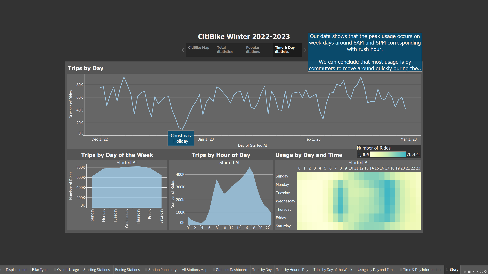

# Challenge 18 - Tableau

### **[Link to Tableau Viz](https://public.tableau.com/views/CitiBike_16887893316850/Story?:language=en-US&publish=yes&:display_count=n&:origin=viz_share_link)**

### Analysis at bottom

## Data
I collected December 2022, January 2023 and February 2023 data from the [New York CitiBike data website](https://s3.amazonaws.com/tripdata/index.html).

This data had the fields:
- Ride ID
- Rideable type
- Started at
- Ended at
- Start station name
- Start station ID
- End station name
- End station ID
- Start latitude
- Start longitude
- End latitude
- End Longitude
- Member or casual ride

In [`reduced_data.ipynb`](reduce_data.ipynb), I combined the three CSV files. Due to the size limit of Tableau being 1 GB, and these being the smallest three file sizes of the last year (and together being 1.01 GB in size), I had to reduce the data to get a smaller file size. To do so, I:
- removed the `ride_id` column as it was unused
- converted the `member_casual` column to `True`/`False` rather than strings
- mapped the values of the `rideable_type` column to single characters rather than full strings
    - "classic_bike"  -> "C"
    - "electric_bike" -> "E"
    - "docked_bike"   -> "D"
- dropped all rows that were missing any data (~15,000)

These actions reduced the combined file size down to an acceptable 829 MB and the row count from 5,257,001 to 5,242,112.

## Tableau
The single csv file was then added to Tableau and visualizations were created to explore different phenomena. Due to the size-limited amount of data, I was unable to examine long trends over the seasons or year.

> NOTE
>
> Tableau on web does not appear to respect fixed size Story and Dashboards.

[Link to Tableau Viz](https://public.tableau.com/views/CitiBike_16887893316850/Story?:language=en-US&publish=yes&:display_count=n&:origin=viz_share_link)

### Images of the four story pages

## Analysis

In order from the Tableau Story:

1. **CitiBike Map**

    The map shows all starting locations the New York City CitiBike program. Using the slider on the right, you can see how new stations have been added, primarily in the South East of the city. The most popular starting locations for rides remains in central Manhattan for all three months.

2. **Total Statistics**

    On this dashboard we see the total values for the winter season. Here we see some interesting information.
    - While the vast majority of rides are half an hour or less, decreasing as time goes on, the number of very long rides stays relatively constant.
    - Most rides are a under a mile to their ending station. 
    - Non-member ride time is on average about 20 minutes, nearly double member ride time. However, both travel about the same average distance of a little over 1 mile. This could be due to many non-members being tourists, making stops between their destinations or being unfamiliar with the area.

3. **Popular Stations**

    The most popular stations for beginning and ending rides are in central Manhattan. This is likely due to the high density of housing and population, as show in the background layers of the two maps.
    - It is also interesting to notice that the stations have almost the exact same number of beginning and ending rides per station. We can conclude that many users are consistently using the same station twice a day, possibly commuting to and from  work or school.

4. **Time & Day Statistics**

    On this dashboard we can see usage for each day in our three month winter season, as well as usage by day of the week and hour in the day.
    - From the visualizations we can see the most common days and times to use the bikes is during curring the commuting hours on weekday. This further reinforces the conclusion from the popular stations section that commuting is a major use case of the bikes.
    - We also see an increase in the early afternoon hours on weekends, but dropping off quickly around 5:00 PM, around the time of sunset in New York City during the winter months.
    

### Potential Future Analysis
- Use weather data to see how temperature and precipitation affect usage.
- Use age and gender data to look for more trends. (This data is no longer included in the public download)
- Use more data over years to find rider growth and yearly trends.
- Use membership data to find out how much the average individual member uses CitiBike.